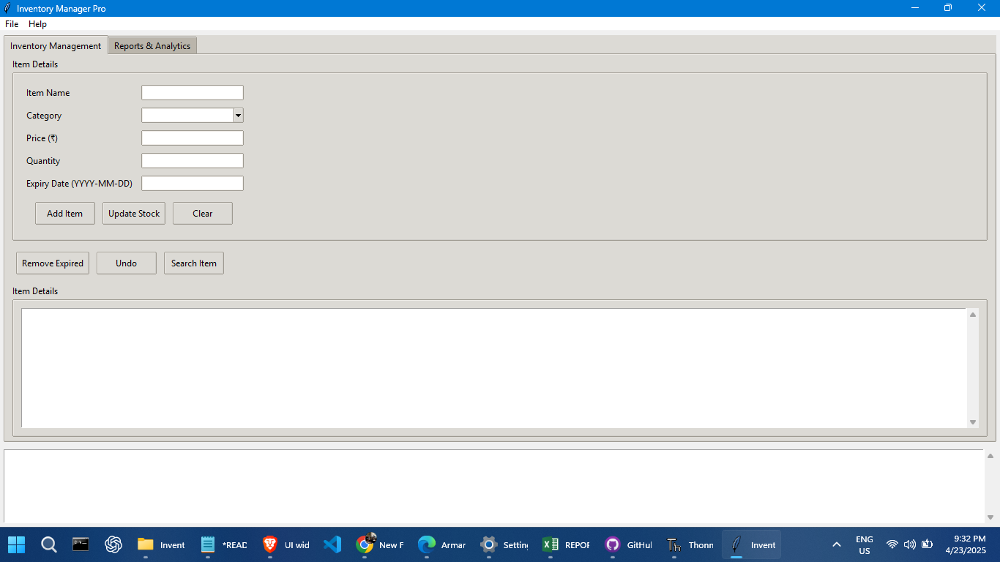
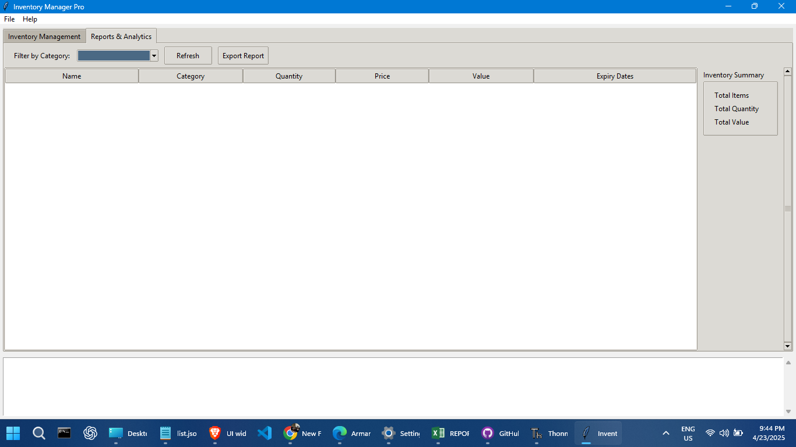
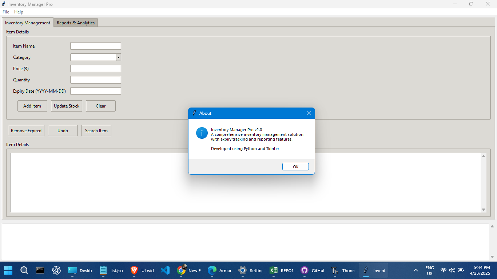

# 🧾 Inventory Management System – GUI Edition (Python Project)

A clean and practical desktop-based inventory manager built with Tkinter. It’s designed especially for small shop owners or students looking to learn GUI development with real-life application logic. This project blends classic data structures with a simple user interface for intuitive stock tracking — no internet, no extras, just Python.

---

## 📌 Project Overview

This Inventory Management System offers:

- A simple, clean GUI built with `Tkinter`
- Core inventory actions: add, update, view, delete
- Built-in logic to manage expiry dates and stock quantities
- Undo feature powered by a stack
- Offline operation (no external libraries required)

**Type**: Desktop GUI App  
**Language**: Python 3  
**Interface**: Tkinter  
**Dependencies**: None (only Python Standard Library)  
**Internet Required**: ❌ 100% Offline

---

## ✅ Key Features

- ✔ Add new inventory items (name, category, quantity, expiry date)
- ✔ Update existing entries — adjust stock or expiry
- ✔ Automatically purge expired items
- ✔ Undo your last operation with a single click
- ✔ Generate simple reports: low-stock and expiry-wise
- ✔ Browse the entire inventory in one view
- ✔ Classical, no-frills GUI that's beginner-friendly

---

## 📦 Data Structures Behind the Scenes

- **Hash Table (`dict`)**:
  - Quickly find and update items by name

- **Queue (`collections.deque`)**:
  - Track expiry dates in a FIFO order to simulate shelf-life

- **Stack (`list`)**:
  - Keeps record of past actions for "Undo" support

---

## 🛠 How to Run

### 🧪 A) Run the Python Script

1. **Install Python 3.x** from [python.org](https://www.python.org)
2. Download or clone this project
3. Open terminal / command prompt
4. Navigate to the project folder
5. Run this:
   ```bash
   python inventory_gui.py
   ```

### 🖥️ B) Build Windows .exe (Optional)

1. Install PyInstaller:
   ```bash
   pip install pyinstaller
   ```

2. In the project folder, run:
   ```bash
   pyinstaller --onefile --windowed --icon=inventory.ico inventory_gui.py
   ```

3. Your executable will appear in the `/dist` folder.

---

## 📁 Project Structure

```
inventory-management-gui/
├── inventory_gui.py        # Main GUI application
├── inventory.ico           # (Optional) App icon
├── README.md               # This file
├── /dist                   # Final .exe after build (PyInstaller)
├── /build                  # Auto-generated build files
└── inventory.spec          # PyInstaller config file
```

---

## 📷 Screenshots & Demo

<p align="center">
  
</p>

<p align="center">
  
</p>

<p align="center">
  
</p>


---

## 🌱 Future Scope

- Add user authentication/login system
- Export reports to CSV or PDF
- Integrate with SQLite for persistent storage
- Create a browser-based version using Flask or Django

---

## 🧑‍💻 Author Info

**👨‍💻 Developer**: Arman Shaikh R  
**🏫 College**: MGR COLLEGE, Hosur  
**📅 Submission**: January 2023  

---

## 📄 License

This project is free to use and modify. Attribution is appreciated.

---

If this helped you or inspired your own project, give it a ⭐ or fork it.  
Simple code. Real-world utility. All in Python.
